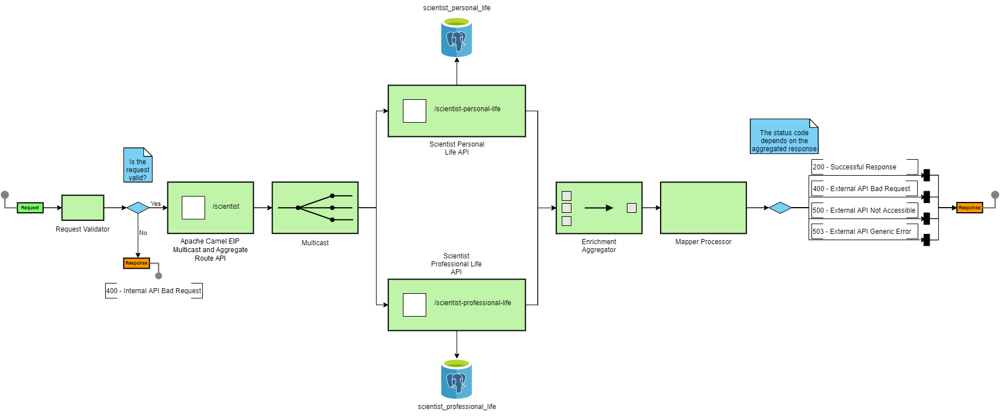

# [Apache Camel EIP Multicast](https://camel.apache.org/components/3.7.x/eips/multicast-eip.html)
# [Apache Camel EIP Aggregate](https://camel.apache.org/components/latest/eips/aggregate-eip.html)

[](https://www.oracle.com/java/technologies/javase/jdk14-archive-downloads.html)
[](https://mvnrepository.com/artifact/org.springframework.boot/spring-boot-starter-parent/2.3.10.RELEASE)
[![Apache Camel](https://img.shields.io/badge/Apache%20Camel-3.9.0-brightgreen?logo=data:image/png;base64,iVBORw0KGgoAAAANSUhEUgAAAA4AAAAOCAMAAAAolt3jAAAB+FBMVEXseSbseCfofSXleCXqfiXldR/////sjSXziyW0opHriSXxhiXyiSXreCbreybrfCbrfSbrfCbreybqeibreSbsbCnreibsfybqeybqeSbueSfreibtgiXqeSPqeCTqeCbtgSXrgjLqdiLsfSbqeyjvgyLrfSndm13reyX08e/sgyX////ynyT////0oiT////////0lCT0mCT////////xiyTyjSX+/v7////6+PftgiXvhSX0hyfGuKt0UjVZMhBnOhPQbiLtfCbreibsfCbtgiXtgyXsgCTsfyXrfSXvhyXvhiXuhCXuhyvuijPsfyLsfSLrfCPwiiTyiiXwiCXwhyPynk/627/1uYbxoF3wmVHvlk/xiSXviiTHch+aWRrTgh73tVr++vT////++vf++PX++vb1wZjhgyKbWhliORJWMRB/UyPx3cH//fj98Nj52brzsXuATBhZMw9aNBFXMQ2Te2X7+/v++fL5yHf1sTTxnyfthCOsmohlQiBYMQxoRSXXzsX72a/1nib1oyL1qiTyoCT+/f3WzMOvnYvRxrz+/v3/+vX3rl70lCH1myT1oST0pyTy1rrwjyvzjyP0kyT1mCT1niTx7+6zgVTrgyLxiyTyjiTzkST6+fijj32SUhnwiSXe1s+bhW9eORatXhztfyXsgCXq5rKuAAAARXRSTlMAAAAAAAAAAAAAAAAALJHb9/jdlTABWdrdYAJY8PNgKtjeMYuX1d7y+vL61d6MlyrY3jFY8PNgAVna3WACLJHb9/jdlTCFf54WAAAAiklEQVQI12NkYGTkZoSA93+BHBFGRj3G/0yMjOcZGZ8xsogDeRBwhvE5ozyjESMMHGNkVLZkRIC9LEw8YMY3Bi4gycTCxAXhijJCuGBrHoEl4bIMmoxQ7h0GEGCDcJmYzoJ4puwgMIuF+b3ESwkGaxaWFbf1pjFfZmQzZGTMBKucDHIXGwOzCcJRAIN0GBXCGF47AAAAAElFTkSuQmCC)](https://mvnrepository.com/artifact/org.apache.camel.springboot/camel-spring-boot-dependencies/3.9.0)
[](http://maven.apache.org/download.cgi)
[](https://mvnrepository.com/artifact/org.postgresql/postgresql/42.2.20)
[](https://docs.docker.com/compose/compose-file)

## Content

- [Introduction](#introduction)
- [Getting Started](#getting-started)
- [Create the data source](#create-the-data-source)
- [Author](#author)

### Introduction <a name="introduction"></a>

This project is an example of how the Multicast EIP together with the Aggregate EIP of the Apache Camel framework work.
Below is the project's structure.

Five docker containers will be created from the 'docker-compose.yml' file, and are listed below.

- Apache Camel EIP Multicast and Aggregate Route Spring Boot API which holds the route orchestration logic and the route
  enrichment logic.
- Scientist Personal Life Spring Boot API that is being called by the Apache Camel EIP Multicast and Aggregate Route
  Spring Boot API to retrieve personal information about a particular scientist.
- Scientist Professional Life Spring Boot API that is being called by the Apache Camel EIP Multicast and Aggregate Route
  Spring Boot API to retrieve professional information about a particular scientist.
- PostgreSQL DB that holds the records.
- Pgadmin GUI for the PostgreSQL DB.



### Getting Started <a name="getting-started"></a>

In order to run this project, the following commands need to be executed in the given order.

- Build the project.

```
    mvn clean install
```

- Start all the docker containers.

```
    docker-compose up -d
```

- Stop all the docker containers

```
    docker-compose down
```

### Create the data source <a name="create-the-data-source"></a>

- Navigate to 'View' - 'Tool Windows' - 'Database'.
- Create a new PostgreSQL DB data source, with the following values.
    - Name: postgresql_datasource
    - Host: localhost
    - Port: 5432
    - User: postgresql
    - Password: postgresql
    - Database: postgresql_db
    - URL: jdbc:postgresql://localhost:5432/postgresql_db

### Author <a name="author"></a>

[Viktor Talevski](https://www.linkedin.com/in/viktor-talevski-a7366794)
